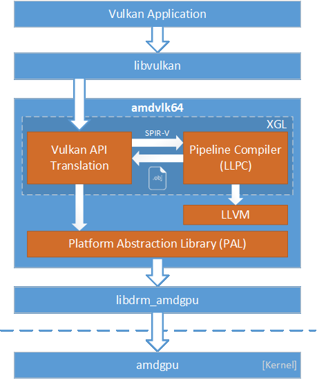

# AMD Open Source Driver for Vulkan&reg;
The AMD Open Source Driver for Vulkan&reg; is an open-source Vulkan driver for Radeon&trade; graphics adapters on Linux&reg;. It is built on top of AMD's Platform Abstraction Library (PAL), a shared component that is designed to encapsulate certain hardware and OS-specific programming details for many of AMD's 3D and compute drivers. Leveraging PAL can help provide a consistent experience across platforms, including support for recently released GPUs and compatibility with AMD developer tools.

Shaders that compose a particular `VkPipeline` object are compiled as a single entity using the LLVM-Based Pipeline Compiler (LLPC) library.  LLPC builds on LLVM's existing shader compilation infrastructure for AMD GPUs to generate code objects compatible with PAL's pipeline ABI. Notably, AMD's closed-source Vulkan driver currently uses a different pipeline compiler, which is the major difference between AMD's open-source and closed-source Vulkan drivers.




### Product Support
The AMD Open Source Driver for Vulkan is designed to support the following AMD GPUs:

* Radeon&trade; RX 7900/7800/7700/7600 Series
* Radeon&trade; RX 6900/6800/6700/6600/6500 Series
* Radeon&trade; RX 5700/5600/5500 Series
* Radeon&trade; Pro W5700/W5500 Series

> **Note**
> For Pre-GFX10 GPUs, please use v-2023.Q3.3 or older release.

### Operating System Support
The AMD Open Source Driver for Vulkan is designed to support following distros and versions on both the AMDGPU upstream driver stack and the [AMDGPU Pro driver stack](https://www.amd.com/en/support/linux-drivers):
* Ubuntu 22.04 (amd64 version)
* Ubuntu 24.04 (amd64 version)
* RedHat 8.0 (x86-64 version)
* RedHat 9.0 (x86-64 version)
* RedHat 10.0 beta (x86-64 version)

The driver has not been well tested on other distros and versions. You may try it out on other distros and versions of your choice.

> **Note**
> To run the Vulkan driver with AMDGPU upstream driver stack on SI and CI generation GPUs, amdgpu.si_support and amdgpu.cik_support need to be enabled in kernel

### Feature Support and Performance
The AMD Open Source Driver for Vulkan is designed to support the following features:

* Vulkan 1.4
* More than 180 extensions
* [Radeon&trade; GPUProfiler](https://github.com/GPUOpen-Tools/Radeon-GPUProfiler) tracing
* Built-in debug and profiling tools
* Mid-command buffer preemption and SR-IOV virtualization

The following features and improvements are planned in future releases (Please refer to [Release Notes](https://github.com/GPUOpen-Drivers/AMDVLK/wiki/Release-notes) for update of each release):
* Upcoming versions of the Vulkan API
* Hardware performance counter collection through [RenderDoc](https://renderdoc.org/)
* LLPC optimizations to improve GPU-limited performance and compile time
* Optimizations to improve CPU-limited performance


### Known Issues
* If you are using upstream stack, you may need to upgrade the kernel to 5.3 or later version and firmware (under /lib/firmware/amdgpu/) to the right version from https://git.kernel.org/pub/scm/linux/kernel/git/firmware/linux-firmware.git/tree/amdgpu, and then update ramfs (sudo update-initramfs -u -k \`uname -r\`)
* Timeline semaphore is not fully supported in Linux kernel until version 5.5. You can install [Vulkan timeline semaphore layer](https://github.com/KhronosGroup/Vulkan-ExtensionLayer) to enable the extension if you are using earlier version of Linux kernel


### How to Contribute
You are welcome to submit contributions of code to the AMD Open Source Driver for Vulkan.

The driver is built from source code in five repositories: [LLVM](https://github.com/GPUOpen-Drivers/llvm-project), [XGL](https://github.com/GPUOpen-Drivers/xgl), [LLPC](https://github.com/GPUOpen-Drivers/llpc), [GPURT](https://github.com/GPUOpen-Drivers/gpurt) and [PAL](https://github.com/GPUOpen-Drivers/pal).

For changes to LLVM, you should submit contribution to the [LLVM trunk](https://reviews.llvm.org/). Commits there will be evaluated to merge into the amd-gfx-gpuopen-master branch periodically.

For changes to XGL, LLPC, GPURT and PAL, please [create a pull request](https://help.github.com/articles/creating-a-pull-request/) against the **dev branch**. After your change is reviewed and if it is accepted, it will be evaluated to merge into the master branch in a subsequent regular promotion.

**IMPORTANT**: By creating a pull request, you agree to allow your contribution to be licensed by the project owners under the terms of the [MIT License](LICENSE.txt).

When contributing to XGL, LLPC, GPURT and PAL, your code should:
* Match the style of nearby existing code. Your code may be edited to comply with our coding standards when it is merged into the master branch.
* Avoid adding new dependencies, including dependencies on STL.

Please make each contribution reasonably small. If you would like to make a big contribution, like a new feature or extension, please raise an issue first to allow planning to evaluate and review your work.

> **Note**
> Since PAL is a shared component that must support other APIs, other operating systems, and pre-production hardware, you might be asked to revise your PAL change for reasons that may not be obvious from a pure Linux Vulkan driver perspective.

## Build Instructions

### System Requirements
It is recommended to install at least 16GB RAM in your build system.

### Build System
* CMake 3.21 or newer is required. [Download](https://cmake.org/download/) and install proper one if the cmake is older than 3.21.
* C++ 20 support is required. Like gcc9, clang11.
* Ninja is required.

### Install Dev and Tools Packages
#### Ubuntu
```
sudo apt-get install build-essential cmake curl g++-multilib gcc-multilib git ninja-build pkg-config python3 python3-jinja2 python3-ruamel.yaml
```
##### 64-bit
```
sudo apt-get install libssl-dev libx11-dev libxcb1-dev x11proto-dri2-dev libxcb-dri3-dev libxcb-dri2-0-dev libxcb-present-dev libxshmfence-dev libxrandr-dev libwayland-dev
```
##### 32-bit
```
dpkg --add-architecture i386
sudo apt-get install libssl-dev:i386 libx11-dev:i386 libxcb1-dev:i386 libxcb-dri3-dev:i386 libxcb-dri2-0-dev:i386 libxcb-present-dev:i386 libxshmfence-dev:i386 libwayland-dev libwayland-dev:i386 libxrandr-dev:i386
```
#### RedHat
##### 64-bit
```
sudo yum -y install openssl-devel gcc-c++ python3 python3-pip curl glibc-devel libstdc++-devel libxcb-devel libX11-devel libxshmfence-devel libXrandr-devel wayland-devel
pip3 install jinja2 ruamel.yaml 
```
##### 32-bit
```
sudo yum -y install openssl-devel.i686 gcc-c++ python3 python3-pip curl glibc-devel.i686 libstdc++-devel.i686 libxcb-devel.i686 libX11-devel.i686 libxshmfence-devel.i686 libXrandr-devel.i686 wayland-devel.i686
pip3 install jinja2 ruamel.yaml 
```

### Install shader compiler tools
Shader compiler tools such as [DirectXShaderCompiler](https://github.com/microsoft/DirectXShaderCompiler) and [glslang](https://github.com/KhronosGroup/glslang) need to be installed to build raytracing support.

#### Ubuntu 22.04
It is recommended to install them from [VulkanSDK](https://packages.lunarg.com/) 1.3.290 or higher.

Ubuntu 22.04 (Jammy)
```
wget -qO- https://packages.lunarg.com/lunarg-signing-key-pub.asc | sudo tee /etc/apt/trusted.gpg.d/lunarg.asc
sudo wget -qO /etc/apt/sources.list.d/lunarg-vulkan-1.3.290-jammy.list https://packages.lunarg.com/vulkan/1.3.290/lunarg-vulkan-1.3.290-jammy.list
sudo apt update
sudo apt install vulkan-sdk
```
#### Others
Get [DirectXShaderCompiler](https://github.com/microsoft/DirectXShaderCompiler) and [glslang](https://github.com/KhronosGroup/glslang) source code and build tools on local.
```
#!/bin/bash

if [ ! -d DirectXShaderCompiler ]; then
git clone --depth=1 -b release-1.8.2403 https://github.com/microsoft/DirectXShaderCompiler.git
fi

if [ ! -d glslang ]; then
git clone --depth=1 -b vulkan-sdk-1.3.290.0 https://github.com/KhronosGroup/glslang.git
fi

cd DirectXShaderCompiler
git submodule init
git submodule update
cmake -H. -Bbuilds -GNinja -DCMAKE_BUILD_TYPE=Release -C ./cmake/caches/PredefinedParams.cmake
cmake --build builds
cd ..

cd glslang
cmake -H. -Bbuilds -DCMAKE_BUILD_TYPE=Release -DCMAKE_INSTALL_PREFIX='builds/install'
cd builds
make -j8 install
cd ../../
```
Set env PATH and LD_LIBRARY_PATH before amdvlk driver build.
```
export PATH=<DirectXShaderCompiler>/builds/bin:<glslang>/install/bin:$PATH
export LD_LIBRARY_PATH=<DirectXShaderCompiler>/builds/lib:$LD_LIBRARY_PATH
```
### Get Repo Tools
```
mkdir ~/bin
curl https://storage.googleapis.com/git-repo-downloads/repo > ~/bin/repo
chmod a+x ~/bin/repo
export PATH=~/bin:"$PATH"
```

### Get Source Code

```
mkdir vulkandriver
cd vulkandriver
repo init -u https://github.com/GPUOpen-Drivers/AMDVLK.git -b master
repo sync
```

> **Note**
> Source code in dev branch can be gotten by using "-b dev" in the "repo init" command.

### Build Driver and Generate JSON Files
```
cmake -G Ninja -S xgl -B builds/Release64
cmake --build builds/Release64

cmake -G Ninja -S xgl -B builds/Release32 -DCMAKE_C_FLAGS=-m32 -DCMAKE_CXX_FLAGS=-m32
cmake --build builds/Release32
```

> **Note**
> * For debug build, use `-DCMAKE_BUILD_TYPE=Debug -DLLVM_PARALLEL_LINK_JOBS=2` (Linking a debug build of llvm is very memory intensive, so we use only two parallel jobs).
> * If you want to build tools (such as [amdllpc](https://github.com/GPUOpen-Drivers/llpc/blob/dev/llpc/docs/amdllpc.md)) together with driver, add `-m build_with_tools.xml` in repo init and add the build option `-DVKI_BUILD_TOOLS=ON`.

## Installation Instructions
### Install Vulkan SDK
You can download and install the SDK package [here](https://vulkan.lunarg.com/sdk/home).

### Install dependencies
#### Ubuntu
```
sudo apt install libssl3
```
#### RedHat
```
sudo yum install openssl-libs
```

### Install Driver and JSON Files
```
sudo cmake --install builds/Release64 --component icd
sudo cmake --install builds/Release32 --component icd
```
> If you want to install driver to customized directory, you can add "-DCMAKE_INSTALL_PREFIX={installation directory}" in the cmake build command. JSON files will be installed to /etc/vulkan/icd.d while other files will be installed to the installation directory you specified.

> If RADV is also installed in the system, AMDVLK driver will be enabled by default after installation. You can switch the driver between AMDVLK and RADV by environment variable AMD_VULKAN_ICD = AMDVLK or RADV.

> **Note:** The remaining steps are only required when running the AMDGPU upstream driver stack.

### Turn on DRI3 and disable modesetting X driver
Add following lines in /usr/share/X11/xorg.conf.d/10-amdgpu.conf:
```
Section "Device"

Identifier "AMDgpu"

Option  "DRI" "3"

EndSection
```

And make sure following line is **NOT** included in the section:
```
Driver      "modesetting"
```

### Required Settings
On the AMDGPU upstream driver stack with libdrm version lower than 2.4.92, the max number of IB per submission **MUST** be limited to 4 (the default setting in AMD Open Source driver for Vulkan is 16). This can be accomplished via the [Runtime Settings](#runtime-settings) mechanism by adding the following line to amdPalSettings.cfg:
```
MaxNumCmdStreamsPerSubmit,4
CommandBufferCombineDePreambles,1
```

### Install with pre-built driver
You could generate the installation package with below command while building driver:
#### Ubuntu
```
cmake -G Ninja -S xgl -B builds/Release64 [-DPACKAGE_VERSION=package version]
cmake --build builds/Release64 --target makePackage
```
#### RedHat
```
cmake -G Ninja -S xgl -B builds/Release64 [-DPACKAGE_VERSION=package version]
cmake --build builds/Release64 --target makePackage
```

You could also download pre-built package from https://github.com/GPUOpen-Drivers/AMDVLK/releases for each code promotion in master branch.

Below is the installation instruction:
#### Ubuntu
```
sudo dpkg -r amdvlk  # If old version is installed on the machine, remove it first 
sudo dpkg -i amdvlk_x.x.x_amd64.deb
sudo apt-get -f install
```
#### RedHat
```
sudo rpm -e amdvlk   # If old version is installed on the machine, remove it first 
sudo rpm -i amdvlk-x.x.x.x86_64.rpm
```

For Ubuntu, you could also install the latest driver build from https://repo.radeon.com:
```
sudo wget -qO - http://repo.radeon.com/amdvlk/apt/debian/amdvlk.gpg.key | sudo apt-key add -
sudo sh -c 'echo deb [arch=amd64,i386] http://repo.radeon.com/amdvlk/apt/debian/ bionic main > /etc/apt/sources.list.d/amdvlk.list'
sudo apt-get remove amdvlk # If old version is installed on the machine, remove it first 
sudo apt update
sudo apt-get install amdvlk
```

## Runtime Settings
The driver exposes many settings that can customize the driver's behavior and facilitate debugging. You can add/edit settings in amdVulkanSettings.cfg or amdPalSettings.cfg file under one of below paths, formatted with one `name,value` pair per line:
* /etc/amd
* $AMD_CONFIG_DIR

Some example settings are listed below:

| Setting Name                   | Valid Values                                                | Comment                                                                                                                           |
| ------------------------------ | ----------------------------------------------------------- | --------------------------------------------------------------------------------------------------------------------------------- |
| `AllowVkPipelineCachingToDisk` | 0: disallow<br/>1: default<br/>                             | 1 is default value which enables Pal's archive-file based caching.<br/>The archive-file is stored under ~/.cache/AMD/VkCache.   |
| `ShaderCacheMode`              | 0: disable cache<br/>1: runtime cache<br/>2: cache to disk  | Runtime cache is the default mode. For "cache to disk", the cache file is generated under $AMD_SHADER_DISK_CACHE_PATH/AMD/LlpcCache or $XDG_CACHE_HOME/AMD/LlpcCache or $HOME/.cache/AMD/LlpcCache   |
| `IFH`                          | 0: default<br/>1: drop all submits<br/>                     | Infinitely Fast Hardware.  Submit calls are dropped before being sent to hardware.  Useful for measuring CPU-limited performance. |
| `EnableVmAlwaysValid`          | 0: disable<br/>1: default<br/>2:  force enable<br/>         | 1 is the default setting which enables the VM-always-valid feature for kernel 4.16 and above.  The feature can reduce command buffer submission overhead related to virtual memory management.     |
| `IdleAfterSubmitGpuMask`       | Bitmask of GPUs (i.e., bit 0 is GPU0, etc.)                 | Forces the CPU to immediately wait for each GPU submission to complete on the specified set of GPUs.  |

*All* available settings can be determined by examining below source files that define them.

* .../xgl/icd/settings/settings.cfg (API layer settings)
* .../pal/src/core/settings_core.json (PAL hardware-independent settings)
* .../pal/src/core/hw/gfxip/gfx6/settings_gfx6.json (PAL GFX6-8 settings)
* .../pal/src/core/hw/gfxip/gfx9/settings_gfx9.json (PAL GFX9+ settings)

Runtime settings are only read at device initialization, and cannot be changed without restarting the application. If running on a system with multiple GPUs, the same settings will apply to all of them.  Lines in the settings file that start with `;` will be treated as comments.


## Enable extensions under development
The extensions under development are not enabled by default in driver. You can enable them through environment variable:
```
export AMDVLK_ENABLE_DEVELOPING_EXT="<extension1-name> [<extension2-name>...]"
```
or
```
export AMDVLK_ENABLE_DEVELOPING_EXT="all"
```
The extension name is case-insensitive.

## PAL GpuProfiler Layer
The GpuProfiler is an optional layer that is designed to intercept the PAL interface to provide basic GPU profiling support.  Currently, this layer is controlled exclusively through runtime settings and outputs its results to file.

You can use the following [Runtime Settings](#runtime-settings) to generate .csv files with GPU timings of work performed during the designated frames of an application (one file for each frame):

| Setting Name                     | Value                            | Comment                                                                                                                                                                                               |
| -------------------------------- | -------------------------------- | ----------------------------------------------------------------------------------------------------------------------------------------------------------------------------------------------------- |
| `GpuProfilerMode`                | 0: disable<br/>1: enable with sqtt off<br/>2: enable with sqtt for thread trace<br/>3: enable with sqtt for RGP                     | Enables and sets the SQTT mode for the GPU performance profiler layer. Actual capture of performance data must be specified via frame number with GpuProfilerConfig_StartFrame or by pressing shift-F11.     |
| `GpuProfilerConfig.LogDirectory` | <nobr>&lt;directory-path></nobr> | The directory path is relative to $AMD_DEBUG_DIR or $TMPDIR or /var/tmp/, default value is "amdpal/". Your application must have write permissions to the directory. The profiling logs are output to a subdirectory that is named in the format like <nobr>&lt;AppName></nobr>_<nobr>&lt;yyyy-MM-dd></nobr>_<nobr>&lt;HH:mm:ss></nobr>. |
| `GpuProfilerConfig.Granularity`  | 0: per-draw<br/>1: per-cmdbuf    | Defines what is measured/profiled.  *Per-draw* times individual commands (such as draw, dispatch, etc.) inside command buffers, while *per-cmdbuf* only profiles entire command buffers in aggregate. |
| `GpuProfilerConfig.StartFrame`   | Positive integer                 | First frame to capture data for.  If StartFrame and FrameCount are not set, all frames will be profiled.                                                                                              |
| `GpuProfilerConfig.FrameCount`   | Positive integer                 | Number of frames to capture data for.                                                                                                                                                               |
| `GpuProfilerConfig.RecordPipelineStats` | 0, 1                             | Gathers pipeline statistic query data per entry if enabled.                                                                                                                                           |

You can use the script [timingReport.py](https://github.com/GPUOpen-Drivers/pal/tree/master/tools/gpuProfilerTools/timingReport.py) to analyze the profiling log:
```
python timingReport.py <profiling_log_subdirectory>
```

## Dump Pipelines and Shaders
The output of timeReport.py includes the information of top pipelines like below:
```
Top Pipelines (>= 1%)
Compiler Hash         | Type         | Avg. Call Count | Avg. GPU Time [us] | Avg. Frame %
1. 0xd91d15e42d62dcbb | VsPs         |              43 |          11,203.15 |      10.20 %
2. 0x724e9af55f2adf1b | Cs           |               1 |           9,347.50 |       8.51 %
3. 0x396e5ad6f7a789f7 | VsHsDsPs     |             468 |           8,401.35 |       7.65 %
```

You can add the following settings to amdPalSettings.cfg to dump the information of each pipeline:
```
EnablePipelineDump,1
PipelineDumpDir,<dump_dir_path>
```
PipelineDumpDir is a sub-path relative to $AMD_DEBUG_DIR or $TMPDIR or /var/tmp/, default value is "spvPipeline/". The pipeline dump file is named in the format like Pipeline<nobr>&lt;Type></nobr>_<nobr>&lt;Compiler_Hash></nobr>.pipe. For example, the above top 1 pipeline is dumped to PipelineVsFs_0xD91D15E42D62DCBB.pipe. The shaders referenced by each pipeline are also dumped to .spv files.

## PAL Debug Overlay
PAL's debug overlay can be enabled to display real time statistics and information on top of a running application.  This includes a rolling FPS average, CPU and GPU frame times, and a ledger tracking how much video memory has been allocated from each available heap.  Benchmarking (i.e., "Benchmark (F11)") is currently unsupported.

| Setting Name                                | Value                                                                                                                   | Comment                                                                                                                             |
| ------------------------------------------- | ----------------------------------------------------------------------------------------------------------------------- | ----------------------------------------------------------------------------------------------------------------------------------- |
| `DebugOverlayEnabled`                       | 0, 1                                                                                                                    | Enables the debug overlay.                                                                                                          |
| `DebugOverlayConfig.DebugOverlayLocation`   | <nobr>0: top-left</nobr><br/><nobr>1: top-right</nobr><br/><nobr>2: bottom-left</nobr><br/><nobr>3: bottom-right</nobr> | Determines where the overlay text should be displayed.  Can be used to avoid collision with important rendering by the application. |
| `DebugOverlayConfig.PrintFrameNumber`       | 0, 1                                                                                                                    | Reports the current frame number.  Useful when determining a good frame range for profiling with the GpuProfiler layer.             |
| `DebugOverlayConfig.TimeGraphEnable`        | 0, 1                                                                                                                    | Enables rendering of a graph of recent CPU and GPU frame times.                                                                     |


## Third Party Software
The AMD Open Source Driver for Vulkan contains code written by third parties.
* [LLVM](https://github.com/GPUOpen-Drivers/llvm-project) is distributed under the Apache License v2.0 with LLVM Exceptions. See LICENSE.TXT file in the top directory of the LLVM repository.
* [MetroHash](https://github.com/GPUOpen-Drivers/MetroHash) is distributed under the terms of Apache License 2.0.  See LICENSE file in the top directory of the MetroHash repository.
* [CWPack](https://github.com/GPUOpen-Drivers/CWPack) is distributed under the terms of MITLicense. See LICENSE file in the top directory of the CWPack repository.
* Please see the README.md file in the [PAL](https://github.com/GPUOpen-Drivers/pal), [LLPC](https://github.com/GPUOpen-Drivers/llpc), [GPURT](https://github.com/GPUOpen-Drivers/gpurt) and [XGL](https://github.com/GPUOpen-Drivers/xgl) repositories for information on third party software used by those libraries.


#### DISCLAIMER
The information contained herein is for informational purposes only, and is subject to change without notice. This document may contain technical inaccuracies, omissions and typographical errors, and AMD is under no obligation to update or otherwise correct this information. Advanced Micro Devices, Inc. makes no representations or warranties with respect to the accuracy or completeness of the contents of this document, and assumes no liability of any kind, including the implied warranties of noninfringement, merchantability or fitness for particular purposes, with respect to the operation or use of AMD hardware, software or other products described herein.  No license, including implied or arising by estoppel, to any intellectual property rights is granted by this document.  Terms and limitations applicable to the purchase or use of AMD's products are as set forth in a signed agreement between the parties or in AMD's Standard Terms and Conditions of Sale.

AMD, the AMD Arrow logo, Radeon, FirePro, and combinations thereof are trademarks of Advanced Micro Devices, Inc.  Other product names used in this publication are for identification purposes only and may be trademarks of their respective companies.

Vega is a codename for AMD architecture, and is not a product name.

Linux is the registered trademark of Linus Torvalds in the U.S. and other countries.

Vulkan and the Vulkan logo are registered trademarks of the Khronos Group, Inc.
